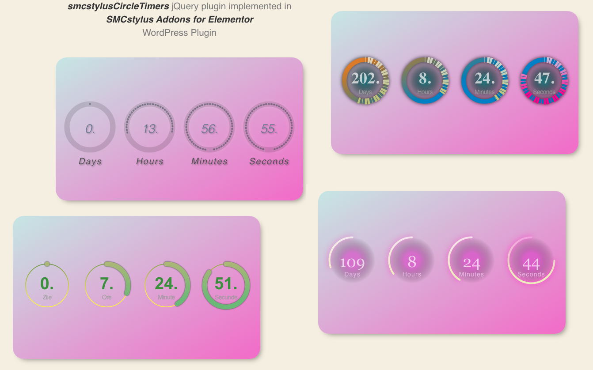

# smcstylusCircleTimers
jQuery SMCstylus Circle Timers is a jQuery plugin that provides beautiful animated countdowns in circle shapes.

Features: You can fill the center of circles, the past time lines and the left time lines with solid or gradient colors. There is also the possibility to change the cap style of animated line. Add separate shadow (color and diffuse) for main timer and left time lines and more...

Down bellow is an image with the implementation of this plugin in an Wordpress Elementor Addon, just to see what you can do with it.

<b>HTML code example:</b>
<pre>
&lt;div class="smc-addel-countdown" data-date="2021-11-16  21:56:00">
&lt;/div>
</pre>
the plugin will generate something like:
<pre>
&lt;div class="smc-addel-countdown" data-date="2021-11-16  21:56:00" data-tc-id="805af5e3-a517-c3df-9bdd-c045b556c103" data-tc-act="running">
&lt;div class="smcstylusCircleTimers">
  &lt;canvas width="540" height="135">&lt;/canvas>
  &lt;div class="smcstylusCircleTimers--inner smcstylusCircleTimers--inner-Days" style="top: 47px; left: 0px; width: 135px;">
    &lt;h4 class="smcstylusCircleTimers--label" style="font-size: 14px;">Days&lt;/h4>
    &lt;span class="smcstylusCircleTimers--number" style="font-size: 36px;">101&lt;/span>
  &lt;/div>
  &lt;div class="smcstylusCircleTimers--inner smcstylusCircleTimers--inner-Hours" style="top: 47px; left: 135px; width: 135px;">
    &lt;h4 class="smcstylusCircleTimers--label" style="font-size: 14px;">Hours&lt;/h4>
    &lt;span class="smcstylusCircleTimers--number" style="font-size: 36px;">0&lt;/span>
  &lt;/div>
  &lt;div class="smcstylusCircleTimers--inner smcstylusCircleTimers--inner-Minutes" style="top: 47px; left: 270px; width: 135px;">
    &lt;h4 class="smcstylusCircleTimers--label" style="font-size: 14px;">Minutes&lt;/h4>
    &lt;span class="smcstylusCircleTimers--number" style="font-size: 36px;">9&lt;/span>
  &lt;/div>
  &lt;div class="smcstylusCircleTimers--inner smcstylusCircleTimers--inner-Seconds" style="top: 47px; left: 405px; width: 135px;">
    &lt;4 class="smcstylusCircleTimers--label" style="font-size: 14px;">Seconds&lt;/h4>
    &lt;span class="smcstylusCircleTimers--number" style="font-size: 36px;">29&lt;/span>
  &lt;/div>
&lt;/div>
&lt;/div>
</pre>
due date: 
we pass the due date on "data-date" attribute  
css stylish: 
div.smc-addel-countdown = our countdown wrapper class 
div.smcstylusCircleTimers = canvas - plugin wrapper 
div.smcstylusCircleTimers--inner = column / timers class 
div.smcstylusCircleTimers--inner-Days,  
div.smcstylusCircleTimers--inner-Hours,  
div.smcstylusCircleTimers--inner-Minutes,  
div.smcstylusCircleTimers--inner-Seconds = timers individal classes 
span.smcstylusCircleTimers--number = numbers / time class 
h4.smcstylusCircleTimers--label = labels class 

<b>Plugin options:</b>
<pre>
// The element which we want to wrap it in to our plugin
let el = $(".smc-addel-countdown").eq(0);

let circleTimerArgs = {
  referenceDate: date , // new Date()
  countPastZero: boolean, // false
  useTopFrame: boolean, // false
  animation: string, // "smooth"
  direction: string, // "Both"
  totalDuration: string, // "Auto"
  labelSize: float, // (10 / 100)
  numberSize:float, // (28 / 100)
  innerFill: boolean, // false
  innerUseGradient: boolean, // false
  innerBackgroundColors: array, // ["#ffcc00"]
  innerCenterSize: integer, // 5
  innerShadowBlur: integer, // 0
  innerShadowColor: string, // "#00000000"
  pastTimeLineShow: boolean, // true
  pastTimeLineWith: float, // 0.15
  pastTimeLineUseGradient: boolean,  // true
  pastTimeLineColors: array, // ["#FFF602", "#447A47"]
  pastTimeLineGradPoints: array, // [5, 101, 0, 0]
  pastTimeLineShadowBlur: integer // 0
  pastTimeLineShadowColor: string, // "#000000"
  pastTimeLineShadowCoordinates:array, // [0, 0]
  leftTimeLineWidth: float, // 0.08
  leftTimeLineCap: string, // "round" 
  leftTimeLineUseGradient: boolean, // true
  leftTimeLineColors: array, // ["#72B96F","#B9B76F"]
  leftTimeLineIndividualColors:boolean, // false
  leftTimeLineShadowBlur: integer, // 3
  leftTimeLineShadowColor: string, // "#262F2F"
  leftTimeLineShadowCoordinates: array, // [3, 4]
  leftTimeLineUIEffect: integer, // 0
  time: {
    Days: {
      show: boolean, // true
      text: string, // "Zile"
      color: string, // ["#f6008b"]
      gradient: boolean,
    },
    Hours: {
      show: boolean,
      text: string,
      color: string,
      gradient: boolean,
    },
    Minutes: {
      show: boolean,
      text: string,
      color: string,
      gradient: boolean,
    },
    Seconds: {
      show: boolean,
      text: string,
      color: string,
      gradient: boolean,
    },
  },
};

// Check if the element exists to avoid errors
if (el.length > 0) {
  $(el)
  .smcstylusCircleTimers(circleTimerArgs);
}
</pre>  

  <b>Rebuild on resize:</b>
<pre>
$(window).resize(() => {
  $(el).smcstylusCircleTimers().rebuild();
});
</pre>

  <b>Add listener:</b>
<pre>
// Call a function when the time is up
$(el)
.smcstylusCircleTimers(circleTimerArgs)
.addListener(countdownCompleteListener);       
</pre>

 <b>Action on document load:</b>
<pre>
// If the time is ended while we are not on page let's tell to plugin what to do 
$(document).ready(() => {
  if ($(el).data("tc-act") === "ended") {
    let el = $(el).smcstylusCircleTimers(circleTimerArgs);
    // Call your function
    countdownComplete(el.elements[0]);
  }
});
</pre>
            
